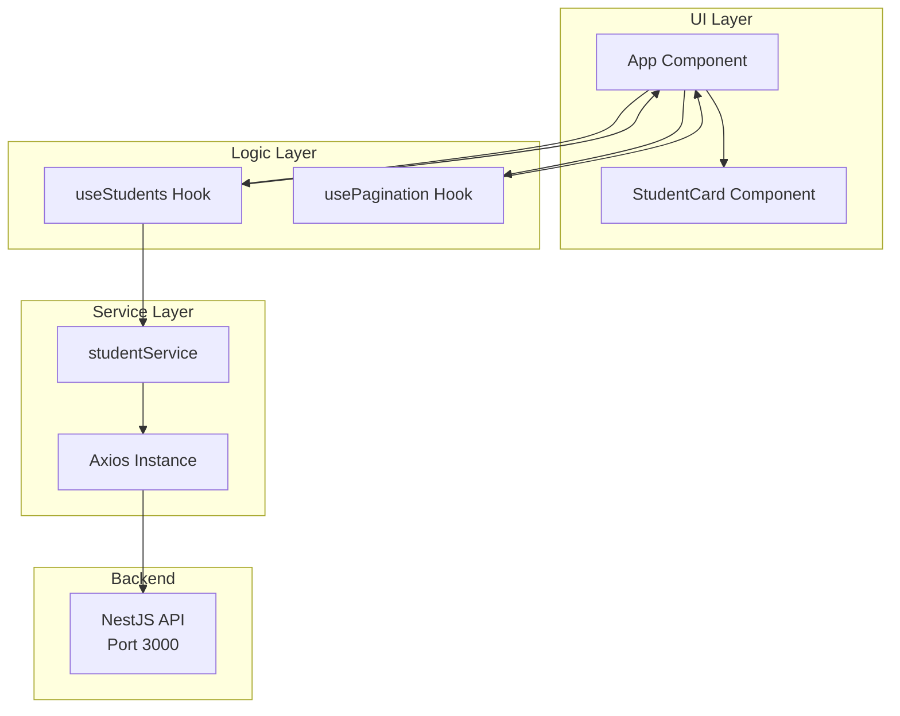
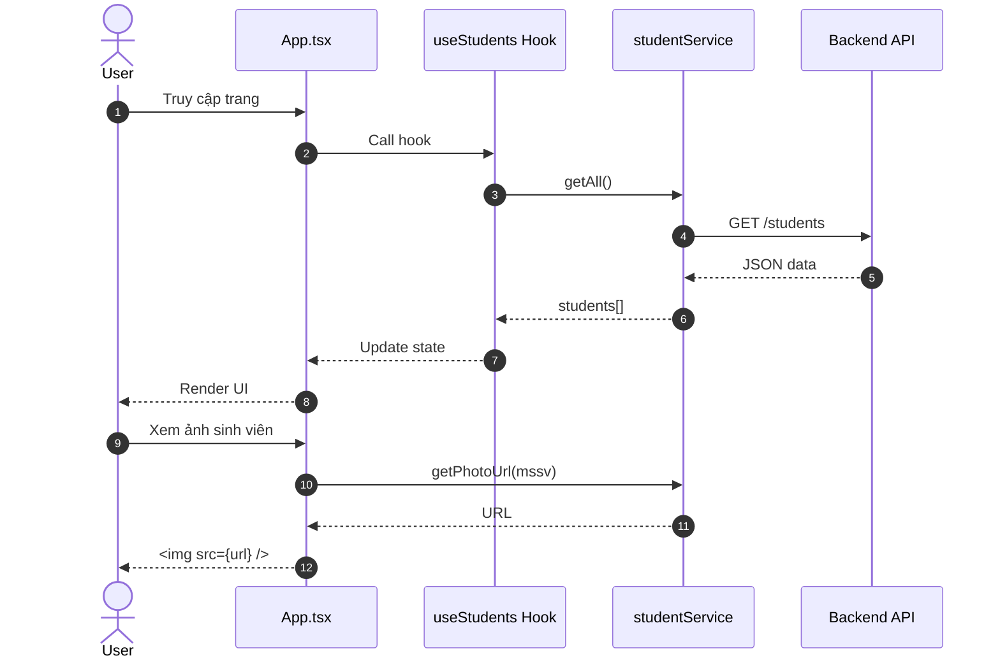
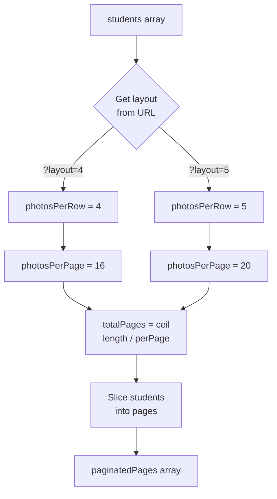

# ClassPortrait Frontend

**Frontend UI cho hệ thống sổ ảnh sinh viên ClassPortrait**

---

## GIỚI THIỆU

**ClassPortrait Frontend** là giao diện web responsive được xây dựng bằng React, cung cấp trải nghiệm xem và in ấn sổ ảnh sinh viên chuyên nghiệp.

### Tính năng chính

- **Hiển thị sổ ảnh**: Grid layout hiện đại với ảnh sinh viên
- **In ấn A4**: Layout tối ưu cho giấy A4 với 2 tùy chọn:
  - 4×4: 16 ảnh/trang (4 hàng × 4 cột)
  - 5×4: 20 ảnh/trang (4 hàng × 5 cột)
- **Responsive**: Tự động điều chỉnh cho Desktop/Tablet/Mobile
- **Performance**: Custom hooks và memoization
- **UI/UX**: Bootstrap 5 với animations mượt mà


- Các hình ảnh khuôn mặt trong tài liệu chỉ mang tính minh họa và đã được làm mờ nhằm đảm bảo quyền riêng tư cá nhân
---

## TÁC GIẢ

- **Họ tên**: Nguyễn Thị Huyền Trang
- **MSSV**: 20225674
- **Email**: Trang.NTH225674@sis.hust.edu.vn

---

## MÔI TRƯỜNG HOẠT ĐỘNG

### Yêu cầu hệ thống

- Node.js 16.x trở lên
- npm hoặc yarn
- Browser: Chrome 90+, Firefox 88+, Safari 14+, Edge 90+
- OS: Windows 10/11, macOS 10.15+, Linux

### Kiến trúc Frontend



### Tech Stack

- **Framework**: React 19.2.0
- **Language**: TypeScript 4.9.5
- **UI Library**: Bootstrap 5.3.8
- **HTTP Client**: Axios 1.13.2
- **Build Tool**: Create React App

---

## HƯỚNG DẪN CÀI ĐẶT VÀ CHẠY THỬ

### Bước 1: Clone repository

```bash
git clone https://github.com/HuyenTranggg/ClassPortrait-frontend.git
cd ClassPortrait-frontend
```

### Bước 2: Cài đặt dependencies

```bash
npm install
```

### Bước 3: Cấu hình (Optional)

Tạo file `.env` nếu muốn thay đổi cấu hình:

```env
# Backend API URL
REACT_APP_API_URL=http://localhost:3000

# Frontend Port (mặc định: 3001)
PORT=3001
```

### Bước 4: Chạy development server

```bash
npm start
```

App sẽ mở tại: **http://localhost:3001**

### Bước 5: Kiểm tra chức năng

1. Màn hình hiển thị danh sách sinh viên
2. Thử chuyển đổi layout: Click "4×4" hoặc "5×4"
3. Thử responsive: Resize browser window
4. Thử in: Click nút "🖨️ In" hoặc Ctrl+P

---

## NGUYÊN LÝ CƠ BẢN

### TÍCH HỢP HỆ THỐNG

Frontend giao tiếp với Backend qua REST API:



### CÁC THUẬT TOÁN CƠ BẢN

#### 1. Pagination Algorithm

**Mục đích**: Chia danh sách sinh viên thành các trang để in



**Implementation**:
```typescript
const photosPerPage = photosPerRow * PAGINATION_CONFIG.ROWS_PER_PAGE; // 4 hàng
const totalPages = Math.ceil(students.length / photosPerPage);

const paginatedPages = Array.from({ length: totalPages }, (_, i) => ({
  pageIndex: i,
  students: students.slice(i * photosPerPage, (i + 1) * photosPerPage)
}));
```

#### 2. Error Handling for Images

**Mục đích**: Hiển thị placeholder khi ảnh lỗi

```typescript
const [imageError, setImageError] = useState(false);
const imageUrl = studentService.getPhotoUrl(mssv);

 setImageError(true)} 
/>
```

---

### ĐẶC TẢ HÀM

#### Custom Hook: useStudents

```typescript
/**
 * Custom hook để fetch và quản lý danh sách sinh viên
 * 
 * @returns {UseStudentsReturn} Object chứa students, loading, error
 * 
 * @example
 * const { students, loading, error } = useStudents();
 * if (loading) return <Loading />;
 * if (error) return <Error message={error} />;
 * return <StudentList students={students} />;
 */
export const useStudents = (): UseStudentsReturn => {
  const [students, setStudents] = useState<Student[]>([]);
  const [loading, setLoading] = useState(true);
  const [error, setError] = useState<string | null>(null);

  const fetchStudents = useCallback(async () => {
    try {
      setLoading(true);
      setError(null);
      const data = await studentService.getAll();
      setStudents(data);
    } catch (err) {
      console.error('Lỗi khi tải danh sách sinh viên:', err);
      setError('Không thể tải danh sách sinh viên. Vui lòng kiểm tra backend đang chạy.');
    } finally {
      setLoading(false);
    }
  }, []);

  useEffect(() => {
    fetchStudents();
  }, [fetchStudents]);

  return { students, loading, error, refetch: fetchStudents };
};
```

#### Custom Hook: usePagination

```typescript
/**
 * Custom hook xử lý phân trang cho in ấn
 * 
 * @param {Student[]} students - Danh sách sinh viên
 * @returns {UsePaginationReturn} Pagination data
 * 
 * @example
 * const { totalPages, paginatedPages } = usePagination(students);
 * paginatedPages.map(page => (
 *   <PrintPage>{page.students.map(s => <Card {...s} />)}</PrintPage>
 * ))
 */
export const usePagination = (students: Student[]): UsePaginationReturn => {
  const photosPerRow = useMemo(() => {
    const urlParams = new URLSearchParams(window.location.search);
    const layoutParam = urlParams.get('layout');
    return layoutParam === '5' ? 5 : PAGINATION_CONFIG.DEFAULT_LAYOUT;
  }, []);

  const photosPerPage = useMemo(
    () => photosPerRow * PAGINATION_CONFIG.ROWS_PER_PAGE,
    [photosPerRow]
  );

  const totalPages = useMemo(
    () => Math.ceil(students.length / photosPerPage),
    [students.length, photosPerPage]
  );

  const paginatedPages = useMemo(
    () =>
      Array.from({ length: totalPages }, (_, pageIndex) => {
        const startIdx = pageIndex * photosPerPage;
        const endIdx = Math.min(startIdx + photosPerPage, students.length);
        const pageStudents = students.slice(startIdx, endIdx);

        return {
          pageIndex,
          students: pageStudents,
        };
      }),
    [totalPages, photosPerPage, students]
  );

  return { photosPerRow, photosPerPage, totalPages, paginatedPages };
};
```

#### StudentService

```typescript
/**
 * Service tương tác với Student API
 */
export const studentService = {
  /**
   * Lấy danh sách tất cả sinh viên
   * @returns {Promise<Student[]>} Promise danh sách sinh viên
   */
  getAll: async (): Promise<Student[]> => {
    const response = await api.get<Student[]>('/students');
    return response.data;
  },

  /**
   * Tạo URL ảnh sinh viên
   * @param {string} mssv - Mã số sinh viên
   * @returns {string} Full URL
   */
  getPhotoUrl: (mssv: string): string => {
    return `${api.defaults.baseURL}/students/${mssv}/photo`;
  }
};
```

---

## KẾT QUẢ

### Screenshots

#### Desktop View (4×4 Layout)

*Giao diện hiển thị 4 cột ảnh sinh viên, phù hợp cho màn hình rộng*

#### Desktop View (5×4 Layout)

*Layout 5 cột giúp tối ưu số lượng ảnh trên mỗi trang in*

#### Print Preview (A4)


---

**Backend**: [ClassPortrait-backend](https://github.com/HuyenTranggg/ClassPortrait-backend)
