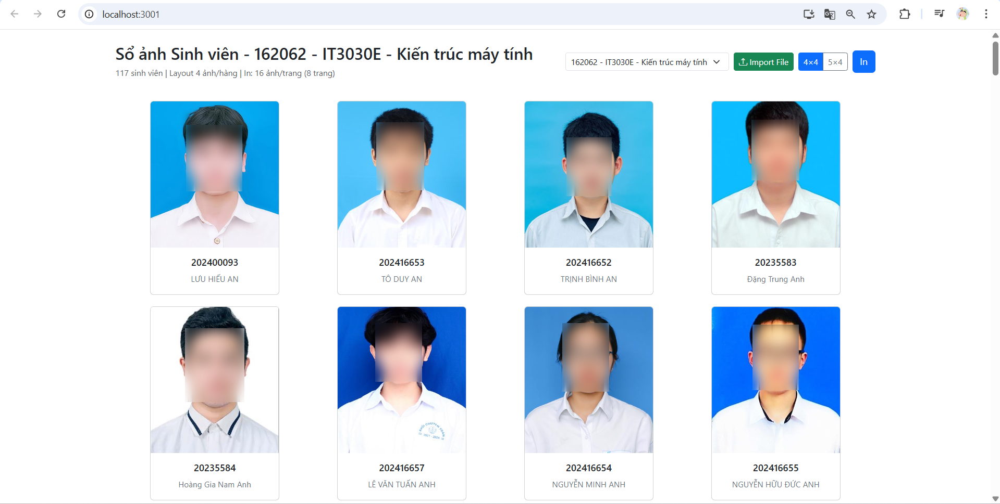
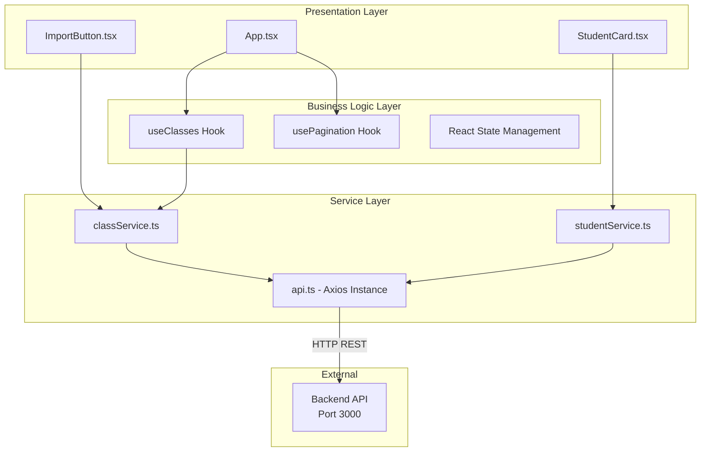
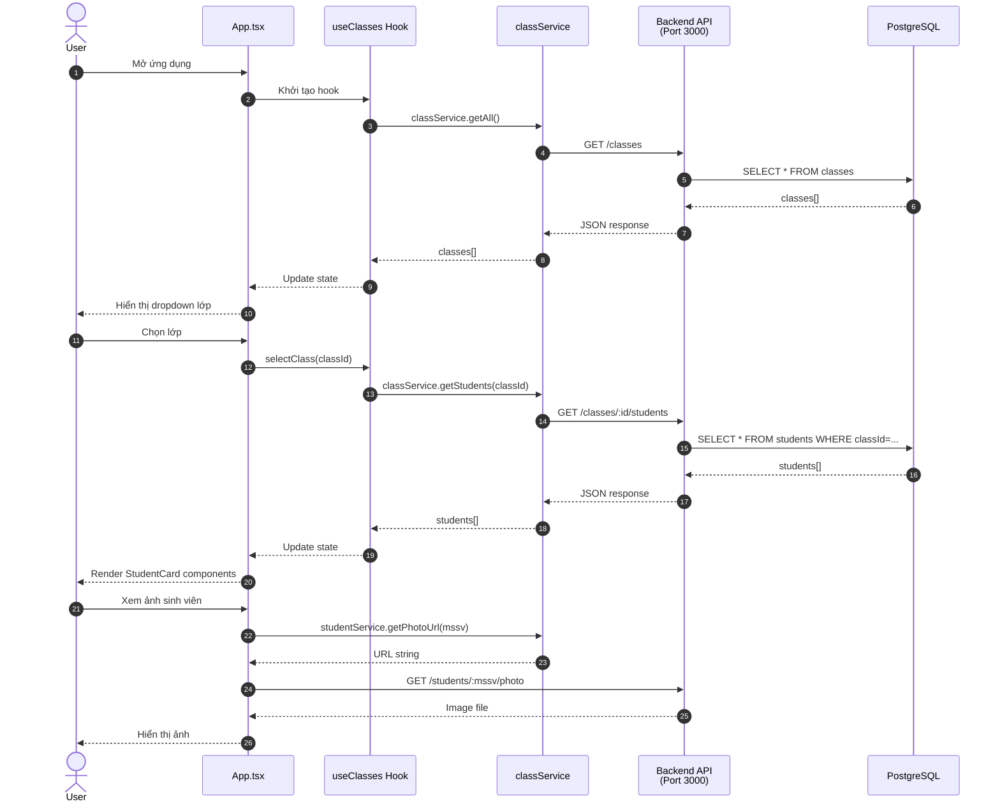
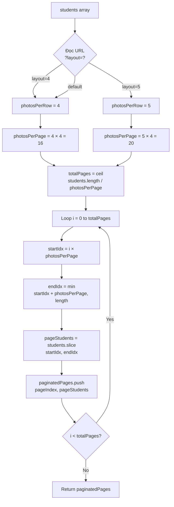
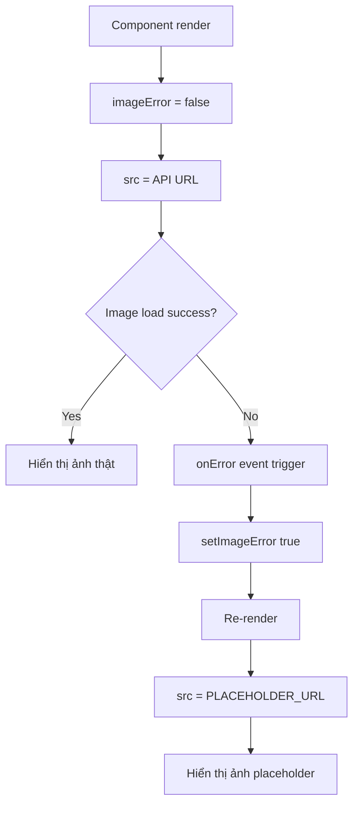
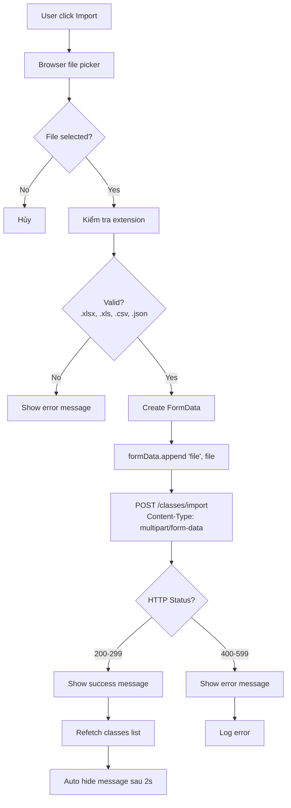
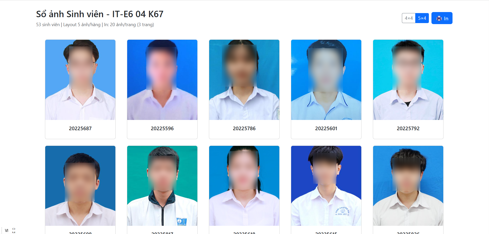
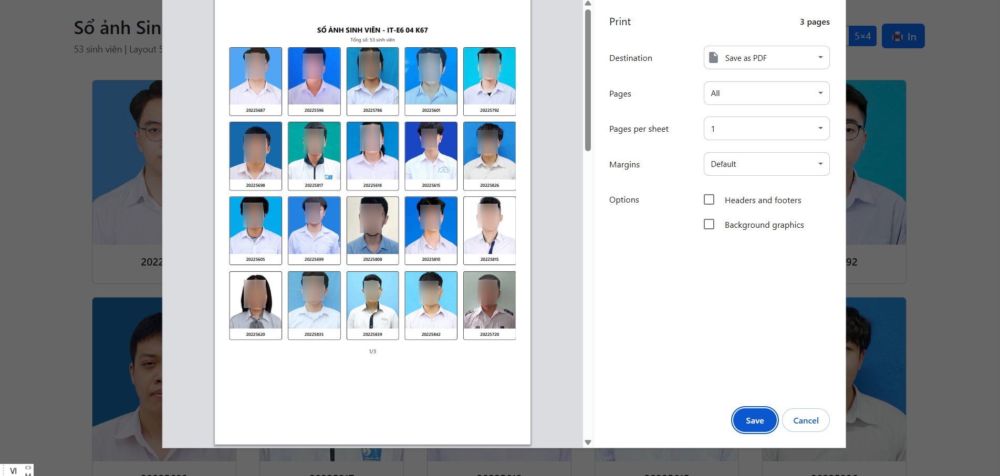

# ClassPortrait Frontend

**Frontend UI cho hệ thống sổ ảnh sinh viên ClassPortrait**

---

## GIỚI THIỆU

**ClassPortrait Frontend** là giao diện web được xây dựng bằng React + TypeScript, cung cấp giao diện hiện đại để quản lý, xem và in sổ ảnh sinh viên theo lớp học; cho phép import danh sách sinh viên từ file Excel/CSV/JSON và hiển thị ảnh sinh viên với layout tối ưu cho in ấn A4.

### Tính năng chính

- **Quản lý lớp học**: Hiển thị và chọn lớp học từ dropdown
- **Import dữ liệu**: Hỗ trợ import file Excel (.xlsx, .xls), CSV (.csv), JSON để tạo lớp mới
- **Hiển thị sổ ảnh**: Grid layout responsive với ảnh và thông tin sinh viên
- **In ấn A4 chuyên nghiệp**: 
  - Layout 4×4: 16 ảnh/trang (4 hàng × 4 cột)
  - Layout 5×4: 20 ảnh/trang (4 hàng × 5 cột)
  - Đánh số trang tự động
- **Responsive Design**: Tự động điều chỉnh giao diện cho Desktop/Tablet/Mobile
- **Performance**: Sử dụng custom hooks, React.memo và useMemo để tối ưu hiệu suất
- **Error Handling**: Xử lý lỗi load ảnh với placeholder tự động



*Lưu ý: Các hình ảnh khuôn mặt trong tài liệu chỉ mang tính minh họa và đã được làm mờ nhằm đảm bảo quyền riêng tư cá nhân*

---

## TÁC GIẢ

- **Họ tên**: Nguyễn Thị Huyền Trang
- **MSSV**: 20225674
- **Email**: Trang.NTH225674@sis.hust.edu.vn

---

## MÔI TRƯỜNG HOẠT ĐỘNG

### Yêu cầu hệ thống

- Node.js 16.x trở lên
- npm hoặc yarn
- Browser: Chrome 90+, Firefox 88+, Safari 14+, Edge 90+
- OS: Windows 10/11, macOS 10.15+, Linux

### Kiến trúc Frontend

Ứng dụng frontend được tổ chức theo kiến trúc 3 lớp (Layered Architecture) với sự phân tách rõ ràng giữa UI, Logic và Data Access:



**Giải thích các layer**:

1. **Presentation Layer** (UI Components):
   - Components React thuần túy, chịu trách nhiệm render UI
   - Không chứa business logic phức tạp
   - Nhận data từ hooks và hiển thị

2. **Business Logic Layer** (Custom Hooks):
   - Custom hooks quản lý state và side effects
   - Xử lý logic nghiệp vụ (phân trang, fetch data, error handling)
   - Tách biệt logic khỏi UI để dễ test và tái sử dụng

3. **Service Layer** (API Services):
   - Tương tác với Backend API qua HTTP
   - Centralized API calls và error handling
   - Axios interceptors cho authentication và logging

### Tech Stack

- **Framework**: React 19.2.0
- **Language**: TypeScript 4.9.5
- **UI Library**: Bootstrap 5.3.8
- **HTTP Client**: Axios 1.13.2
- **Build Tool**: Create React App

---

## HƯỚNG DẪN CÀI ĐẶT VÀ CHẠY THỬ

### Bước 1: Chuẩn bị môi trường

Đảm bảo đã cài đặt:
- Node.js 16+ và npm
- Backend API đang chạy tại `http://localhost:3000`

### Bước 2: Clone repository

```bash
git clone https://github.com/HuyenTranggg/ClassPortrait-frontend.git
cd ClassPortrait-frontend
```

### Bước 3: Cài đặt dependencies

```bash
npm install
```

### Bước 4: Cấu hình

Tạo file `.env` nếu muốn thay đổi cấu hình mặc định:

```env
# Backend API URL (mặc định: http://localhost:3000)
REACT_APP_API_URL=http://localhost:3000

# Frontend Port (mặc định: 3001)
PORT=3001
```

### Bước 5: Chạy development server

```bash
npm start
```

Ứng dụng sẽ tự động mở tại: **http://localhost:3001**

### Bước 6: Kiểm tra chức năng (Self Test)

**Tình huống sử dụng cơ bản:**

1. **Xem danh sách lớp**: 
   - Mở dropdown "Chọn lớp" ở góc trên bên phải
   - Chọn một lớp học để xem danh sách sinh viên

2. **Import lớp mới**:
   - Click nút "Import File"
   - Chọn file Excel/CSV/JSON chứa danh sách sinh viên
   - Chờ thông báo "Import thành công"

3. **Thay đổi layout**:
   - Click nút "4×4" để hiển thị 16 ảnh/trang
   - Click nút "5×4" để hiển thị 20 ảnh/trang

4. **In sổ ảnh**:
   - Click nút "In" hoặc nhấn `Ctrl+P` (Windows) / `Cmd+P` (Mac)
   - Xem trước bản in với layout đã chọn
   - Đảm bảo chọn khổ giấy A4 trong cài đặt máy in

5. **Kiểm tra responsive**:
   - Resize cửa sổ browser để xem giao diện thích ứng
   - Mở trên mobile/tablet để kiểm tra responsive

**Kết quả mong đợi**: Ứng dụng hiển thị danh sách sinh viên với ảnh đầy đủ, có thể in ra giấy A4 với layout rõ ràng.

---

## NGUYÊN LÝ CƠ BẢN

### TÍCH HỢP HỆ THỐNG

Ứng dụng frontend được chia thành 3 layer chính với kiến trúc component-based:

**1. UI Layer** (Presentation Layer):
- `App.tsx`: Component gốc, điều phối toàn bộ UI
- `StudentCard.tsx`: Component hiển thị thẻ sinh viên (ảnh + thông tin)
- `ImportButton.tsx`: Component upload file import

**2. Logic Layer** (Business Logic):
- `useClasses.ts`: Custom hook quản lý state lớp học và sinh viên
- `usePagination.ts`: Custom hook xử lý phân trang cho in ấn
- Sử dụng React hooks (useState, useEffect, useCallback, useMemo) để tối ưu performance

**3. Service Layer** (Data Access):
- `classService.ts`: API calls cho lớp học (getAll, getById, getStudents, importClass, delete)
- `studentService.ts`: API calls cho sinh viên (getPhotoUrl)
- `api.ts`: Axios instance với interceptors cho error handling tập trung

**Luồng tương tác hệ thống**:



---

### CÁC THUẬT TOÁN CƠ BẢN
---
#### 1. Thuật toán Pagination cho In ấn

**Mục đích**: Chia danh sách sinh viên thành các trang A4 với layout tối ưu

**Input**: 
- `students`: Mảng danh sách sinh viên
- `layout`: Query parameter từ URL (`?layout=4` hoặc `?layout=5`)

**Output**: 
- `paginatedPages`: Mảng các trang, mỗi trang chứa một nhóm sinh viên

**Công thức**:
- `photosPerRow` = 4 hoặc 5 (từ URL parameter)
- `photosPerPage` = `photosPerRow` × 4 (4 hàng cố định)
- `totalPages` = ceil(`students.length` / `photosPerPage`)

**Flowchart**:



**Implementation**:

```typescript
export const usePagination = (students: Student[]) => {
  // Đọc layout từ URL
  const photosPerRow = useMemo(() => {
    const params = new URLSearchParams(window.location.search);
    return params.get('layout') === '5' ? 5 : 4;
  }, []);

  // Tính số ảnh/trang (4 hàng cố định)
  const photosPerPage = photosPerRow * 4;

  // Tính tổng số trang
  const totalPages = Math.ceil(students.length / photosPerPage);

  // Phân chia thành các trang
  const paginatedPages = Array.from({ length: totalPages }, (_, i) => ({
    pageIndex: i,
    students: students.slice(i * photosPerPage, (i + 1) * photosPerPage)
  }));

  return { photosPerRow, photosPerPage, totalPages, paginatedPages };
};
```

#### 2. Thuật toán Error Handling cho Hình ảnh

**Mục đích**: Hiển thị placeholder khi ảnh sinh viên không tồn tại hoặc lỗi load

**Cơ chế**: Sử dụng React state và `onError` event



**Implementation**:

```typescript
function StudentCard({ mssv, name }: StudentCardProps) {
  const [imageError, setImageError] = useState(false);
  const imageUrl = studentService.getPhotoUrl(mssv); // http://localhost:3000/students/{mssv}/photo

  return (
     setImageError(true)} // Khi lỗi, chuyển sang placeholder
    />
  );
}
```

#### 3. Thuật toán Import File

**Mục đích**: Upload file Excel/CSV/JSON lên server để tạo lớp mới

**Flow**:



---

### ĐẶC TẢ HÀM

---

#### Custom Hook: useClasses

```typescript
/**
 * Custom hook quản lý state cho danh sách lớp học và sinh viên
 * Bao gồm: fetch data từ API, xử lý loading, error, và state management
 * 
 * @returns {UseClassesReturn} Object chứa classes, selectedClass, students, loading, error và các hàm tiện ích
 * 
 * @example
 * function App() {
 *   const { classes, selectedClass, students, loading, error, selectClass } = useClasses();
 *   
 *   if (loading) return <Loading />;
 *   if (error) return <Error message={error} />;
 *   
 *   return (
 *     <select onChange={(e) => selectClass(e.target.value)}>
 *       {classes.map(cls => (
 *         <option key={cls.id} value={cls.id}>{cls.classCode}</option>
 *       ))}
 *     </select>
 *   );
 * }
 */
export const useClasses = (): UseClassesReturn => {
  const [classes, setClasses] = useState<Class[]>([]);
  const [selectedClass, setSelectedClass] = useState<Class | null>(null);
  const [students, setStudents] = useState<Student[]>([]);
  const [loading, setLoading] = useState(true);
  const [error, setError] = useState<string | null>(null);

  /**
   * Lấy danh sách tất cả các lớp từ API
   * Tự động chọn lớp đầu tiên nếu chưa có lớp nào được chọn
   * 
   * @private
   * @throws {Error} Khi không thể kết nối Backend API
   */
  const fetchClasses = useCallback(async () => {
    try {
      setLoading(true);
      setError(null);
      const data = await classService.getAll();
      setClasses(data);
      
      // Tự động chọn lớp đầu tiên nếu có
      if (data.length > 0 && !selectedClass) {
        await selectClassInternal(data[0].id, data);
      }
    } catch (err) {
      console.error('Lỗi khi tải danh sách lớp:', err);
      setError('Không thể tải danh sách lớp. Vui lòng kiểm tra backend đang chạy.');
    } finally {
      setLoading(false);
    }
  }, [selectedClass]);

  /**
   * Chọn một lớp và load danh sách sinh viên của lớp đó
   * 
   * @param {string} classId - UUID của lớp cần chọn
   * @returns {Promise<void>}
   * @throws {Error} Khi không tìm thấy lớp hoặc không load được danh sách sinh viên
   */
  const selectClass = useCallback(async (classId: string) => {
    try {
      setLoading(true);
      setError(null);
      
      // Tìm thông tin lớp từ danh sách
      const classData = classes.find(c => c.id === classId);
      if (classData) {
        setSelectedClass(classData);
      }
      
      // Lấy danh sách sinh viên của lớp
      const studentsData = await classService.getStudents(classId);
      setStudents(studentsData);
    } catch (err) {
      console.error('Lỗi khi tải danh sách sinh viên:', err);
      setError('Không thể tải danh sách sinh viên của lớp này.');
      setStudents([]);
    } finally {
      setLoading(false);
    }
  }, [classes]);

  /**
   * Refresh danh sách lớp từ server
   * Sử dụng sau khi import lớp mới
   * 
   * @returns {Promise<void>}
   */
  const refetchClasses = useCallback(async () => {
    await fetchClasses();
  }, [fetchClasses]);

  // Fetch classes khi component mount
  useEffect(() => {
    fetchClasses();
  }, []);

  return {
    classes,
    selectedClass,
    students,
    loading,
    error,
    selectClass,
    refetchClasses,
  };
};

interface UseClassesReturn {
  classes: Class[];                                 // Danh sách tất cả lớp học
  selectedClass: Class | null;                      // Lớp học đang được chọn
  students: Student[];                              // Danh sách sinh viên của lớp đang chọn
  loading: boolean;                                 // true khi đang fetch data
  error: string | null;                             // Thông báo lỗi (null nếu không có lỗi)
  selectClass: (classId: string) => Promise<void>;  // Hàm chọn lớp
  refetchClasses: () => Promise<void>;              // Hàm refresh danh sách lớp
}
```

---

#### Custom Hook: usePagination

```typescript
/**
 * Custom hook xử lý phân trang danh sách sinh viên cho in ấn A4
 * Tính toán số trang và phân chia sinh viên vào từng trang dựa trên layout
 * 
 * @param {Student[]} students - Danh sách sinh viên cần phân trang
 * @returns {UsePaginationReturn} Object chứa thông tin phân trang
 * 
 * @example
 * const { totalPages, paginatedPages, photosPerRow } = usePagination(students);
 * 
 * return (
 *   <>
 *     {paginatedPages.map(({ pageIndex, students: pageStudents }) => (
 *       <div key={pageIndex} className="page">
 *         {pageStudents.map(student => (
 *           <StudentCard key={student.mssv} {...student} />
 *         ))}
 *       </div>
 *     ))}
 *   </>
 * );
 */
export const usePagination = (students: Student[]): UsePaginationReturn => {
  /**
   * Đọc layout từ URL query parameter
   * Mặc định là 4 nếu không có hoặc giá trị không hợp lệ
   */
  const photosPerRow = useMemo(() => {
    const urlParams = new URLSearchParams(window.location.search);
    const layoutParam = urlParams.get('layout');
    return layoutParam === '5' ? 5 : PAGINATION_CONFIG.DEFAULT_LAYOUT;
  }, []);

  /**
   * Tính số ảnh/trang = photosPerRow × 4 hàng
   */
  const photosPerPage = useMemo(
    () => photosPerRow * PAGINATION_CONFIG.ROWS_PER_PAGE,
    [photosPerRow]
  );

  /**
   * Tính tổng số trang = ceil(tổng sinh viên / số ảnh per page)
   */
  const totalPages = useMemo(
    () => Math.ceil(students.length / photosPerPage),
    [students.length, photosPerPage]
  );

  /**
   * Phân chia sinh viên vào từng trang
   * Mỗi trang chứa pageIndex và mảng sinh viên tương ứng
   */
  const paginatedPages = useMemo(
    () =>
      Array.from({ length: totalPages }, (_, pageIndex) => {
        const startIdx = pageIndex * photosPerPage;
        const endIdx = Math.min(startIdx + photosPerPage, students.length);
        const pageStudents = students.slice(startIdx, endIdx);

        return {
          pageIndex,
          students: pageStudents,
        };
      }),
    [totalPages, photosPerPage, students]
  );

  return { photosPerRow, photosPerPage, totalPages, paginatedPages };
};

interface UsePaginationReturn {
  photosPerRow: number;   // Số ảnh/hàng (4 hoặc 5)
  photosPerPage: number;  // Số ảnh/trang (16 hoặc 20)
  totalPages: number;     // Tổng số trang
  paginatedPages: Array<{ // Mảng các trang đã phân chia
    pageIndex: number;
    students: Student[];
  }>;
}
```

---

#### ClassService

```typescript
/**
 * Service xử lý các API calls liên quan đến lớp học
 */
export const classService = {
  /**
   * Lấy danh sách tất cả các lớp học
   * 
   * @returns {Promise<Class[]>} Promise chứa mảng các lớp học
   * @throws {AxiosError} Khi không kết nối được Backend hoặc lỗi server
   * 
   * @example
   * const classes = await classService.getAll();
   * // classes = [
   * //   { id: "550e8400-...", classCode: "123456", courseCode: "IT3280", ... }
   * // ]
   */
  getAll: async (): Promise<Class[]> => {
    const response = await api.get<Class[]>('/classes');
    return response.data;
  },

  /**
   * Lấy thông tin chi tiết một lớp (bao gồm danh sách sinh viên)
   * 
   * @param {string} id - UUID của lớp học
   * @returns {Promise<Class>} Promise chứa thông tin lớp
   * @throws {AxiosError} Status 404 nếu không tìm thấy lớp
   * 
   * @example
   * const classData = await classService.getById("550e8400-e29b-41d4-a716-446655440000");
   * // classData = { id: "...", classCode: "123456", students: [...] }
   */
  getById: async (id: string): Promise<Class> => {
    const response = await api.get<Class>(`/classes/${id}`);
    return response.data;
  },

  /**
   * Lấy danh sách sinh viên của một lớp
   * 
   * @param {string} id - UUID của lớp học
   * @returns {Promise<Student[]>} Promise chứa mảng sinh viên
   * @throws {AxiosError} Status 404 nếu không tìm thấy lớp
   * 
   * @example
   * const students = await classService.getStudents("550e8400-...");
   * // students = [
   * //   { mssv: "20225674", name: "Nguyễn Thị Huyền Trang" },
   * //   { mssv: "20220001", name: "Trần Văn A" }
   * // ]
   */
  getStudents: async (id: string): Promise<Student[]> => {
    const response = await api.get<Student[]>(`/classes/${id}/students`);
    return response.data;
  },

  /**
   * Import lớp học mới từ file Excel, CSV hoặc JSON
   * Upload file với FormData (multipart/form-data)
   * 
   * @param {File} file - File Excel (.xlsx, .xls), CSV (.csv) hoặc JSON (.json)
   * @returns {Promise<{ message: string }>} Promise với thông báo kết quả
   * @throws {AxiosError} Status 400 nếu file không hợp lệ hoặc thiếu dữ liệu bắt buộc
   * 
   * @example
   * const file = document.querySelector('input[type="file"]').files[0];
   * const result = await classService.importClass(file);
   * console.log(result.message); 
   * // "Import thành công lớp 123456 với 45 sinh viên"
   */
  importClass: async (file: File): Promise<{ message: string }> => {
    const formData = new FormData();
    formData.append('file', file);
    
    const response = await api.post<{ message: string }>('/classes/import', formData, {
      headers: {
        'Content-Type': 'multipart/form-data',
      },
    });
    return response.data;
  },

  /**
   * Xóa một lớp và tất cả quan hệ với sinh viên
   * (Lưu ý: Không xóa sinh viên, chỉ xóa quan hệ)
   * 
   * @param {string} id - UUID của lớp cần xóa
   * @returns {Promise<{ message: string }>} Promise với thông báo kết quả
   * @throws {AxiosError} Status 404 nếu không tìm thấy lớp
   * 
   * @example
   * const result = await classService.delete("550e8400-...");
   * console.log(result.message); // "Đã xóa lớp 123456 thành công"
   */
  delete: async (id: string): Promise<{ message: string }> => {
    const response = await api.delete<{ message: string }>(`/classes/${id}`);
    return response.data;
  },
};
```

---

#### StudentService

```typescript
/**
 * Service xử lý các API calls liên quan đến sinh viên
 */
export const studentService = {
  /**
   * Tạo URL để lấy ảnh của sinh viên từ Backend
   * Backend sẽ proxy request tới Toolhub API hoặc trả về ảnh từ storage
   * 
   * @param {string} mssv - Mã số sinh viên (8 ký tự)
   * @returns {string} URL đầy đủ để fetch ảnh
   * 
   * @example
   * const url = studentService.getPhotoUrl("20225674");
   * // url = "http://localhost:3000/students/20225674/photo"
   * 
   * // Sử dụng trong component
   * 
   */
  getPhotoUrl: (mssv: string): string => {
    return `${api.defaults.baseURL}/students/${mssv}/photo`;
  },
};
```

---

#### Component: StudentCard

```typescript
interface StudentCardProps {
  mssv: string;   // Mã số sinh viên (bắt buộc)
  name?: string;  // Họ tên sinh viên (optional)
}

/**
 * Component hiển thị thẻ sinh viên với ảnh và thông tin
 * Tự động xử lý lỗi load ảnh bằng placeholder
 * 
 * @param {StudentCardProps} props - Props của component
 * @returns {JSX.Element} Card component
 * 
 * @example
 * <StudentCard mssv="20225674" name="Nguyễn Thị Huyền Trang" />
 */
function StudentCard({ mssv, name }: StudentCardProps) {
  const [imageError, setImageError] = useState(false);
  const imageUrl = studentService.getPhotoUrl(mssv);

  return (
    <div className="card student-card">
       setImageError(true)}
      />
      <div className="card-body">
        <h6 className="card-title">{mssv}</h6>
        {name && <span className="student-name">{name}</span>}
      </div>
    </div>
  );
}

export default StudentCard;
```

---

## KẾT QUẢ

### Screenshots

#### 1. Desktop View - Layout 4×4

*Giao diện hiển thị 4 cột ảnh sinh viên với Bootstrap cards, phù hợp cho màn hình rộng*

---

#### 2. Desktop View - Layout 5×4

*Layout 5 cột giúp tối ưu số lượng ảnh trên mỗi trang in (20 ảnh/trang thay vì 16 ảnh/trang)*

---

#### 3. Print Preview A4

*Xem trước bản in A4 với layout tối ưu, đánh số trang tự động*

---

### Tính năng đã hoàn thành

- Hiển thị danh sách lớp học từ Backend API
- Chọn lớp và xem danh sách sinh viên
- Import file Excel/CSV/JSON để tạo lớp mới
- Hiển thị ảnh sinh viên với error handling (placeholder)
- Layout responsive cho Desktop/Tablet/Mobile
- In ấn A4 với 2 layout: 4×4 (16 ảnh/trang) và 5×4 (20 ảnh/trang)
- Đánh số trang tự động khi in
- Custom hooks để tối ưu performance (useMemo, useCallback)

---

Backend:

**Backend Repository**: [ClassPortrait-backend](https://github.com/HuyenTranggg/ClassPortrait-backend)
